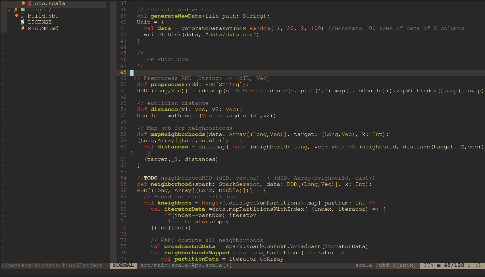

# nvim

My nvim files. It has some asethetic updates and tools to make vim more cozy. I mostly code in Scala, Java, and Python.

**Language Server**

I use Coc for my language server. Install a language via :CocInstall

**Theme**: Molokai

**Plugin Manager**: VimPlug

## Plugins

| Name | Description |
|---|---|
| Coc | For autocompleltion |
~~| semshi| Syntax Highlighting[Not used]|~~
~~| haskell-vim | Haskell syntax highlighting|~~
| vim-polgot | |
| FZF | for fuzzy searching|
| traces | Highlights regex patterns|
| nerdtree | File manager in vim|
| vim-nerdtree-syntax-highlight | nerdtree highlighting|
| auto-pairs | autogenerates bracket pairs|
| goyo.vim | centers work screen. Nice for writing text documents|
| tagbar | window that shows function definitions|
| vim-devicons | Adds language icons for NERD-TREE.|
| gruvbox | A clean, easy to read theme|
| vim airline | sub bar that shows vim information|
| vim-nightfly-guicolors | for themes|
| vim-css-color | highlights hex values|
| vim-pythonsense | python text objects and motions|
| nvim-dap-python | python debugger |
| suda | sudo write to file |

Recent Changes:

* Added Latex compile and preview
* Updated colorscheme
* added debugger(dap)
* added fzf support. (Ctrl-F and leader-g)
